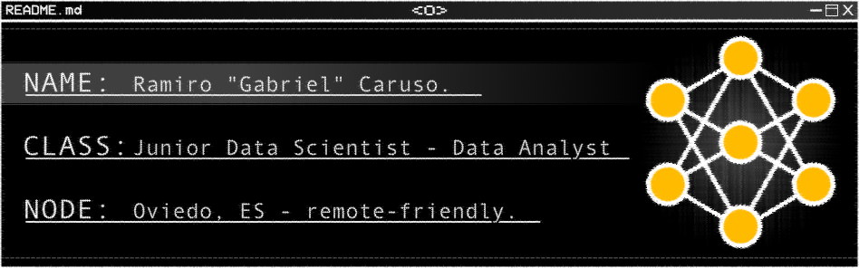
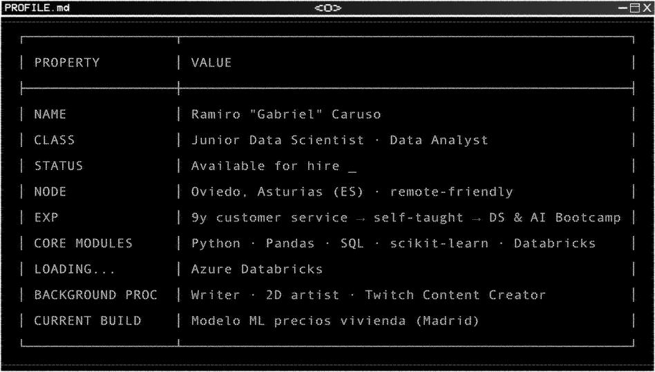

<div align="center">
  
</div>

<!-- Blinking Cursor Typing SVG -->
<div align="center">

[](https://git.io/typing-svg)

</div>

---

<div align="center">
  


</div>

<div>

<div align="center">
  
</div>

</div>

---

<div align="center">


</div>

### Tasador de vivienda en Madrid
**ML end-to-end: de anuncios scrapeados en bruto a una API REST pública**

> **R² 0,86 · ~16 % de error medio en el 80 % del mercado · −49 % de error frente al baseline**

Predice el precio de venta de una vivienda en Madrid a partir de los datos de su anuncio (11,8k anuncios de Idealista).

- **Limpieza de datos:** valores centinela, NaNs estructurales frente a faltantes reales, duplicados ocultos eliminados con una clave de 9 campos y más de 50 variables extraídas de las etiquetas de texto libre.
- **Modelado:** Baseline lineal frente a XGBoost, LightGBM y CatBoost, con split estratificado por distrito y ajuste con Optuna. Ganador: CatBoost.
- **Hallazgo clave:** la ingeniería de variables (barrio + etiquetas) redujo el error 10 veces más que el ajuste de hiperparámetros.
- **Despliegue:** FastAPI en Render, con validación de entradas, GET/POST `/predict` y documentación interactiva con Swagger.

[](https://tch-5-despliegue.onrender.com/docs)
[](https://github.com/Gabriel-Caruso/ML-idealista)
[](https://github.com/A-Manz/TCH-5-Despliegue/tree/develop)

`Python · CatBoost · Optuna · scikit-learn · FastAPI · Render`
<sub>Proyecto en equipo con Ana Manzanares. Me encargué de la limpieza de datos, el modelado y la optimización. La primera petición puede tardar ~1 min porque el servidor gratuito arranca en frío.</sub>


---
<div align="center">


</div>

```text
*This section is a work in progress*
```


---


<div align="center">
  
## ▓▒░ SYSTEMS & TECHNOLOGIES ░▒▓

**LANGUAGES**  
   

**DATA / ML**  
   

**CLOUD / DATA**  
  

**TOOLS**  
   

</div>

---

```text
                                        ╔═══════════════════════════════════════════════════╗
                                        ║ sysop@gabriel.caruso: pip list --core             ║
                                        ╠══════════════════╦════════════════════════════════╣
                                        ║ PACKAGE          ║ PROFICIENCY                    ║
                                        ╠══════════════════╬════════════════════════════════╣
                                        ║ python           ║ ███████░  solid                ║
                                        ║ pandas · numpy   ║ ███████░  solid                ║
                                        ║ scikit-learn     ║ ███████░  solid                ║
                                        ║ sql              ║ ███████░  solid                ║
                                        ║ git · github     ║ ██████░░  daily driver         ║
                                        ║ azure            ║ █████░░░  in use               ║
                                        ║ databricks       ║ ███░░░░░  loading...           ║
                                        ╚══════════════════╩════════════════════════════════╝
```

---


## System Diagnostics & Streaks

<div align="center">


</div>

<br>

<div align="center">

[](https://git.io/streak-stats)

</div>

---

<div align="center">
  
## ▓▒░ PROJECTS MAINTAINED ░▒▓

</div>

<div align="center">

<table cellspacing="10" cellpadding="0" border="0">
  <tr>
    <td>
      <a href="https://github.com/gabriel-caruso/ML-idealista">
        
      </a>
    </td>
    <td>
      <a href="https://github.com/gabriel-caruso/DS-Online-Ramiro-Caruso">
        
      </a>
    </td>
  </tr>
  <tr>
    <td>
      <a href="https://github.com/gabriel-caruso/Hundir-la-flota">
        
      </a>
    </td>
    <td></td>
  </tr>
</table>

</div>

---

## Establish Contact

<div align="center">

[](https://github.com/gabriel-caruso) [](https://linkedin.com/in/www.linkedin.com/in/ramiro-caruso-964899125) [](https://x.com/Gabrien_)

</div>

---
